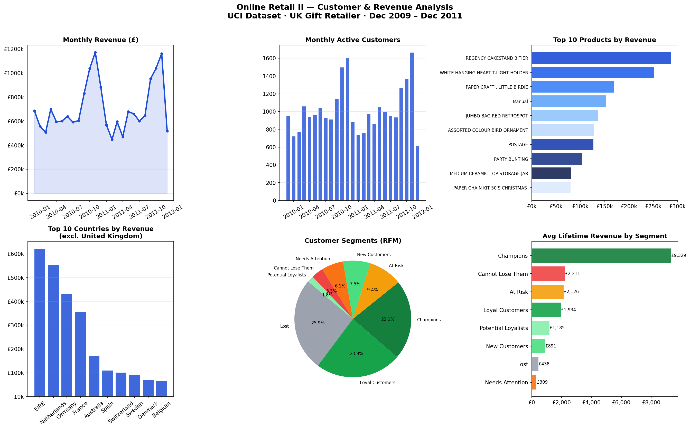

# Online Retail — Customer & Revenue Analysis

Exploratory data analysis and RFM customer segmentation on a real UK-based online gift retailer's transaction data (2009–2011), sourced from the UCI Machine Learning Repository.



## Dataset

**UCI Online Retail II** — ~1M real transactions from a UK gift wholesaler.  
Download: https://www.kaggle.com/datasets/mashlyn/online-retail-ii-uci  
Place `online_retail_II.csv` in the project root before running.

| Column | Description |
|---|---|
| `Invoice` | Transaction ID (prefix C = cancellation) |
| `StockCode` | Product code |
| `Description` | Product name |
| `Quantity` | Units per transaction |
| `InvoiceDate` | Date and time of transaction |
| `Price` | Unit price in GBP |
| `Customer ID` | Unique customer identifier |
| `Country` | Customer's country |

## What the analysis covers

**Data cleaning** — cancellations (Invoice prefix `C`), missing customer IDs, and negative/zero quantities and prices are all dropped before anything is calculated.

**Revenue trends** — monthly revenue and active customer count across the full two-year window. There's a clear November 2011 spike, likely early Christmas wholesale orders coming in bulk.

**Product & country breakdown** — top 10 products by total revenue; top 10 countries excluding the UK, which accounts for the vast majority of sales on its own. EIRE (Ireland) edges out the Netherlands for the top non-UK spot, probably due to geographic proximity and similar B2B ordering patterns.

**RFM segmentation** — each customer is scored 1–5 on three dimensions (Recency, Frequency, Monetary) and assigned to one of eight segments: Champions · Loyal Customers · New Customers · Potential Loyalists · At Risk · Cannot Lose Them · Needs Attention · Lost.

## Running it

```bash
pip3 install -r requirements.txt
python3 analysis.py
```

Outputs:
- `retail_analysis.png` — 6-panel chart
- `rfm_segments.csv` — every customer with their RFM scores and segment label

## Key findings

- Champions spend an average of ~£9,300 lifetime vs ~£440 for Lost customers — roughly a **21x difference**, not evenly distributed at all
- **25.9% of customers are Lost** — they haven't purchased in a long time and have low frequency/spend; probably not worth heavy re-engagement spend
- The At Risk segment (avg. ~£2,100 lifetime spend) is the interesting one — they were once frequent buyers and are worth a targeted retention push before they cross into Lost
- Non-UK revenue is heavily concentrated: EIRE, Netherlands, and Germany together make up the bulk of international sales

## Tools

Python · pandas · NumPy · Matplotlib · UCI ML Repository
